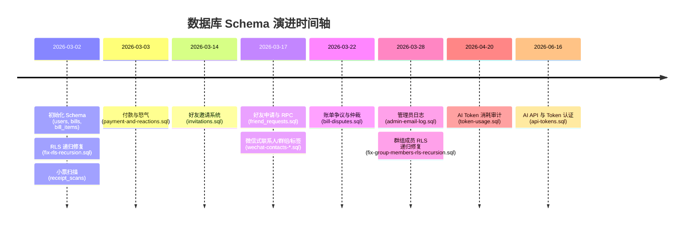

# 分一下 (fenyixia) 后端、数据库与服务端逻辑深度代码测绘与考古报告

> **调研时间**：2026-09-26  
> **考古对象**：数据库总 Schema 演进、RLS 策略与死锁修复、4 个 Supabase Edge Functions、前端数据访问层与历史遗迹、技术债务与安全边界。  
> **代码测绘基准**：所有事实与分析均精确对齐至仓库源码 `file:line`。

---

## 1. 数据库总 Schema 演进与表结构测绘

项目基于 **Supabase (PostgreSQL 15+)** 架构，经历了从“单体纯客户端直连”到“引入 Edge Functions、联系人分组标签、争议仲裁、API Tokens”的完整演变。

### 1.1 核心基础表结构 (`supabase-schema.sql` & `receipt-scans-schema.sql`)

在初始上线阶段，数据库由两个基础 SQL 脚本定义：

#### ① 用户与分账基础关系表 ([`supabase-schema.sql`](file:///Users/robin/Desktop/fenyixia/supabase-schema.sql))

| 表名 | 字段定义 | 主键/外键/约束 | 索引 | 业务意图 |
| :--- | :--- | :--- | :--- | :--- |
| **`users`** | `id` uuid<br>`name` text NOT NULL<br>`email` text NOT NULL<br>`emoji` text DEFAULT '😀'<br>`color` text DEFAULT '#1c1c26'<br>`pin_hash` text<br>`created_at` timestamptz DEFAULT now() | PK: `id` (default `gen_random_uuid()`)<br>UNIQUE: `email` | 无显式独立索引（依赖 PK & UNIQUE 索引） | 存储用户公开 Profile 与早期 6 位 PIN 凭证 ([`supabase-schema.sql:7-15`](file:///Users/robin/Desktop/fenyixia/supabase-schema.sql#L7-L15)) |
| **`friendships`** | `id` uuid<br>`user_a` uuid NOT NULL<br>`user_b` uuid NOT NULL<br>`created_at` timestamptz DEFAULT now() | PK: `id`<br>FK: `user_a` → `users(id)` ON DELETE CASCADE<br>FK: `user_b` → `users(id)` ON DELETE CASCADE<br>UNIQUE: `(user_a, user_b)` | `idx_friendships_a (user_a)`<br>`idx_friendships_b (user_b)` | 双向好友关系。约定为 `user_a < user_b` 规范序 ([`supabase-schema.sql:18-24`](file:///Users/robin/Desktop/fenyixia/supabase-schema.sql#L18-L24)) |
| **`bills`** | `id` uuid<br>`icon` text DEFAULT '🧾'<br>`title` text NOT NULL<br>`description` text<br>`total_amount` numeric(10,2) NOT NULL<br>`date` date DEFAULT current_date<br>`payer_id` uuid NOT NULL<br>`settled` boolean DEFAULT false<br>`color` text<br>`created_at` timestamptz DEFAULT now() | PK: `id`<br>FK: `payer_id` → `users(id)` | `idx_bills_payer (payer_id)`<br>`idx_bills_date (date desc)` | 账单主表，记录垫付人、总金额与结清状态 ([`supabase-schema.sql:27-38`](file:///Users/robin/Desktop/fenyixia/supabase-schema.sql#L27-L38)) |
| **`bill_items`** | `id` uuid<br>`bill_id` uuid NOT NULL<br>`name` text NOT NULL<br>`price` numeric(10,2) NOT NULL<br>`qty` int DEFAULT 1<br>`sort_order` int DEFAULT 0 | PK: `id`<br>FK: `bill_id` → `bills(id)` ON DELETE CASCADE | `idx_bill_items_bill (bill_id)` | 账单细分条目，对应小票每一行 ([`supabase-schema.sql:41-48`](file:///Users/robin/Desktop/fenyixia/supabase-schema.sql#L41-L48)) |
| **`bill_item_members`** | `item_id` uuid NOT NULL<br>`user_id` uuid NOT NULL | PK: `(item_id, user_id)`<br>FK: `item_id` → `bill_items(id)` ON DELETE CASCADE<br>FK: `user_id` → `users(id)` ON DELETE CASCADE | `idx_bill_item_members_user (user_id)` | 条目与参与分摊人多对多关联 ([`supabase-schema.sql:51-55`](file:///Users/robin/Desktop/fenyixia/supabase-schema.sql#L51-L55)) |

#### ② 基础核心视图 ([`supabase-schema.sql:60-89`](file:///Users/robin/Desktop/fenyixia/supabase-schema.sql#L60-L89))
- **`my_bills`**：联合查询当前登录用户作为垫付人（`b.payer_id = auth.uid()`）或分摊成员（`bim.user_id = auth.uid()`）的所有账单去重集合。
- **`bill_shares`**：使用 `LATERAL` 子查询计算每个条目的分摊人总数 `member_count.cnt`，聚合计算每个人在某账单的实际应付金额 `sum(bi.price * bi.qty / member_count.cnt)`。

#### ③ 小票 OCR 扫描表与存储 ([`receipt-scans-schema.sql`](file:///Users/robin/Desktop/fenyixia/receipt-scans-schema.sql))
- **`receipt_scans`**：
  - 字段：`id` uuid, `user_id` uuid (FK → `users.id` CASCADE), `image_path` text, `scan_result` jsonb, `bill_id` uuid (FK → `bills.id` SET NULL), `created_at` timestamptz ([`receipt-scans-schema.sql:7-14`](file:///Users/robin/Desktop/fenyixia/receipt-scans-schema.sql#L7-L14))。
  - 索引：`idx_receipt_scans_user (user_id)`, `idx_receipt_scans_created (created_at desc)`。
  - Storage Bucket：`receipt-images`（私有 bucket，`public = false`，RLS 要求路径前缀必须匹配 `auth.uid()::text`，见 [`receipt-scans-schema.sql:36-51`](file:///Users/robin/Desktop/fenyixia/receipt-scans-schema.sql#L36-L51)）。

---

### 1.2 迁移脚本增量演进考古 (`supabase/migrations/` 全部 13 个脚本)

按功能域与 Git 提交演进时间线梳理全部 13 个 SQL 迁移脚本：



| 序号 | 迁移文件 | 变更对象 (DDL) | 关键字段/约束 | 业务意图与架构设计 |
| :--- | :--- | :--- | :--- | :--- |
| **1** | [`payment-and-reactions.sql`](file:///Users/robin/Desktop/fenyixia/supabase/migrations/payment-and-reactions.sql) | 新建 `payment_proofs`<br>新建 `bill_reactions`<br>配置 `payment-proofs` Bucket | `payment_proofs(id, bill_id, user_id, image_url, created_at)`<br>`bill_reactions(id, bill_id, user_id, anger_count, seen, updated_at, UNIQUE(bill_id, user_id))` | 引入还款凭证图片上传（公开 Bucket）与“怒气抗议”交互机制 ([`L4-L31`](file:///Users/robin/Desktop/fenyixia/supabase/migrations/payment-and-reactions.sql#L4-L31)) |
| **2** | [`invitations.sql`](file:///Users/robin/Desktop/fenyixia/supabase/migrations/invitations.sql) | 新建 `invitations` 表 | `id`, `inviter_id` (FK → users), `email`, `token` (DEFAULT `encode(gen_random_bytes(16), 'hex')` UNIQUE), `status` ('pending', 'accepted', 'expired') | 支持通过邮箱邀请未注册室友，生成 32 位 Hex Token ([`L2-L9`](file:///Users/robin/Desktop/fenyixia/supabase/migrations/invitations.sql#L2-L9)) |
| **3** | [`friend_requests.sql`](file:///Users/robin/Desktop/fenyixia/supabase/migrations/friend_requests.sql) | 新建 `friend_requests` 表<br>创建 3 个 PL/pgSQL RPC 函数 | `from_user`, `to_user`, `status` ('pending', 'accepted', 'rejected'), UNIQUE(`from_user`, `to_user`)<br>RPC: `search_user_by_email`<br>RPC: `accept_friend_request`<br>RPC: `reject_friend_request` | 将瞬时好友关系升级为异步好友申请机制；`accept_friend_request` 内部使用 `least()`/`greatest()` 规范化插入 `friendships` ([`L40-L65`](file:///Users/robin/Desktop/fenyixia/supabase/migrations/friend_requests.sql#L40-L65)) |
| **4** | [`wechat-contacts-friendships.sql`](file:///Users/robin/Desktop/fenyixia/supabase/migrations/wechat-contacts-friendships.sql) | ALTER `friendships` | `ADD COLUMN status text DEFAULT 'accepted'` CHECK IN ('pending','accepted','rejected')<br>`ADD COLUMN alias_a text`<br>`ADD COLUMN alias_b text` | 为旧 `friendships` 补充单向备注名（`alias_a` 为 A 对 B 的备注，`alias_b` 为 B 对 A 的备注）及向下兼容状态 ([`L7-L15`](file:///Users/robin/Desktop/fenyixia/supabase/migrations/wechat-contacts-friendships.sql#L7-L15)) |
| **5** | [`wechat-contacts-groups.sql`](file:///Users/robin/Desktop/fenyixia/supabase/migrations/wechat-contacts-groups.sql) | 新建 `groups`<br>新建 `group_members` | `groups(id, name, emoji, owner_id FK users, created_at)`<br>`group_members(group_id, user_id, joined_at, PK(group_id, user_id))` | 类似微信群聊的分组功能，支持整群批量快速勾选分摊人 ([`L5-L18`](file:///Users/robin/Desktop/fenyixia/supabase/migrations/wechat-contacts-groups.sql#L5-L18)) |
| **6** | [`wechat-contacts-tags.sql`](file:///Users/robin/Desktop/fenyixia/supabase/migrations/wechat-contacts-tags.sql) | 新建 `user_tags`<br>新建 `friend_tags` | `user_tags(id, user_id FK users, name, color, UNIQUE(user_id, name))`<br>`friend_tags(tag_id FK user_tags, friendship_id FK friendships, PK(tag_id, friendship_id))` | 个人私有好友标签分类（如“高频室友”、“自驾游队友”） ([`L6-L19`](file:///Users/robin/Desktop/fenyixia/supabase/migrations/wechat-contacts-tags.sql#L6-L19)) |
| **7** | [`wechat-contacts-rls.sql`](file:///Users/robin/Desktop/fenyixia/supabase/migrations/wechat-contacts-rls.sql) | 针对 groups, group_members, user_tags, friend_tags, friendships 配置 RLS | 详见后文 RLS 章节分析 | 为微信式通讯录提供基础访问控制（含引发递归死锁的旧策略） ([`L7-L75`](file:///Users/robin/Desktop/fenyixia/supabase/migrations/wechat-contacts-rls.sql#L7-L75)) |
| **8** | [`bill-disputes.sql`](file:///Users/robin/Desktop/fenyixia/supabase/migrations/bill-disputes.sql) | 新建 `bill_disputes` 表 | `id`, `bill_id` (FK bills CASCADE), `challenger_id` (FK auth.users), `reason` text, `suggested_items` jsonb, `status` ('pending','accepted','rejected') | 账单成员发起分摊异议，存储 AI 裁决重算的 `suggested_items` JSON 方案 ([`L2-L10`](file:///Users/robin/Desktop/fenyixia/supabase/migrations/bill-disputes.sql#L2-L10)) |
| **9** | [`bill-disputes-update-rls.sql`](file:///Users/robin/Desktop/fenyixia/supabase/migrations/bill-disputes-update-rls.sql) | 为 `bill_disputes` 增加 UPDATE 策略 | `USING (challenger_id = auth.uid() AND status = 'pending')` | 允许质疑人在 pending 状态下二次编辑 AI 生成的建议条目 ([`L2-L6`](file:///Users/robin/Desktop/fenyixia/supabase/migrations/bill-disputes-update-rls.sql#L2-L6)) |
| **10** | [`fix-group-members-rls-recursion.sql`](file:///Users/robin/Desktop/fenyixia/supabase/migrations/fix-group-members-rls-recursion.sql) | 创建 RPC `get_my_group_ids()`<br>重建 `group_members_read` 策略 | 函数声明 `SECURITY DEFINER`，返回当前用户所属的 `group_id` | 彻底修复非群主成员因自身 RLS 循环而无法读取群成员列表的重大 Bug ([`L6-L23`](file:///Users/robin/Desktop/fenyixia/supabase/migrations/fix-group-members-rls-recursion.sql#L6-L23)) |
| **11** | [`admin-email-log.sql`](file:///Users/robin/Desktop/fenyixia/supabase/migrations/admin-email-log.sql) | 新建 `admin_email_log` 表 | `id`, `recipient_email` text, `email_type` text, `sent_at` timestamptz DEFAULT now() | 记录所有通过 `send-email` 函数发出的邮件，追踪免费套餐 3封/小时速率限制 ([`L5-L10`](file:///Users/robin/Desktop/fenyixia/supabase/migrations/admin-email-log.sql#L5-L10)) |
| **12** | [`token-usage.sql`](file:///Users/robin/Desktop/fenyixia/supabase/migrations/token-usage.sql) | 新建 `token_usage` 表 | `id`, `user_id` uuid, `feature` text, `model` text, `input_tokens` int, `output_tokens` int | 跟踪 Claude API（小票识别 / 争议仲裁）各用户 Token 消耗及成本计费 ([`L2-L10`](file:///Users/robin/Desktop/fenyixia/supabase/migrations/token-usage.sql#L2-L10)) |
| **13** | [`api-tokens.sql`](file:///Users/robin/Desktop/fenyixia/supabase/migrations/api-tokens.sql) | 新建 `api_tokens` 表 | `id`, `user_id` (FK auth.users CASCADE), `token` text UNIQUE, `name` text, `last_used_at` timestamptz | 为外部个人 AI 助手（如 OpenClaw、外部 Bot）提供长期 Bearer API 鉴权令牌 ([`L1-L8`](file:///Users/robin/Desktop/fenyixia/supabase/migrations/api-tokens.sql#L1-L8)) |

---

### 1.3 RLS 策略深度解剖与三大历史死锁/Bug

PostgreSQL 的行级安全性 (RLS) 是 Supabase 无中台架构的核心防护网。但在本项目演进中，经历了三次严重的 RLS 设计缺陷与修复：

#### ① 历史 Bug 1：账单三表互相引用导致的“无限递归死锁”
- **缺陷源码**：在初始 [`supabase-schema.sql:121-143`](file:///Users/robin/Desktop/fenyixia/supabase-schema.sql#L121-L143) 中：
  ```sql
  -- bills 表查询依赖 bill_items 和 bill_item_members
  create policy "bills_read" on bills for select using (
    payer_id = auth.uid() or id in (
      select bi.bill_id from bill_items bi
      join bill_item_members bim on bim.item_id = bi.id
      where bim.user_id = auth.uid()
    )
  );
  -- bill_items 表查询又反查 bills
  create policy "bill_items_read" on bill_items for select using (
    bill_id in (select id from bills)
  );
  ```
- **死锁原因**：当客户端执行 `SELECT * FROM bills` 时，Postgres 展开 `bills_read` 策略，触发对 `bill_items` 的扫描；而评估 `bill_items` 时又激活 `bill_items_read`，从而再次触发对 `bills` 的扫描。Postgres 抛出错误：`ERROR: infinite recursion detected in policy for relation "bills"`。
- **修复方案 ([`fix-rls-recursion.sql`](file:///Users/robin/Desktop/fenyixia/fix-rls-recursion.sql))**：
  引入 `SECURITY DEFINER` 特权函数打破循环：
  ```sql
  create or replace function get_my_bill_ids()
  returns setof uuid language sql security definer stable set search_path = public as $$
    select id from bills where payer_id = auth.uid()
    union
    select bi.bill_id from bill_items bi
    join bill_item_members bim on bim.item_id = bi.id
    where bim.user_id = auth.uid()
  $$;
  ```
  通过 `SECURITY DEFINER`，函数以所有者权限直接读取底层数据，**内部执行时完全跳过 RLS 引擎**，随后三张表的 Read 策略统一变更为单向依赖 `id IN (select get_my_bill_ids())` ([`fix-rls-recursion.sql:30-43`](file:///Users/robin/Desktop/fenyixia/fix-rls-recursion.sql#L30-L43))。

#### ② 历史 Bug 2：`STABLE` 函数导致 INSERT 无法回显与 DELETE 策略缺失
- **缺陷源码与现象**：在初版修复后，前端执行 `supabase.from('bills').insert({...}).select().single()` 时发生诡异失败：数据库记录插入成功，但客户端收到 null 或 RLS 拒绝错误；且用户无法删除账单条目。
- **原因**：
  1. `get_my_bill_ids()` 标记为了 `STABLE`。在同一个事务内，刚执行完 INSERT 的账单行还未插入任何 `bill_items`，快照或条件不匹配导致该函数无法返回刚插入的账单 ID，从而被 `bills_read` 拦截。
  2. 初始 schema 漏写了 `DELETE` 策略，导致前端无法物理删除账单。
- **修复方案 ([`fix-rls-insert.sql`](file:///Users/robin/Desktop/fenyixia/fix-rls-insert.sql))**：
  1. 将 `bills_read` 明确加上短路条件：`payer_id = auth.uid() OR id IN (SELECT get_my_bill_ids())` ([`fix-rls-insert.sql:8-11`](file:///Users/robin/Desktop/fenyixia/fix-rls-insert.sql#L8-L11))，确保垫付人无条件立即读取自身插入的行。
  2. 补齐 `bills_delete`, `bill_items_delete`, `bill_item_members_delete` 策略 ([`fix-rls-insert.sql:29-60`](file:///Users/robin/Desktop/fenyixia/fix-rls-insert.sql#L29-L60))。

#### ③ 历史 Bug 3：群组成员表自引用递归 ([`fix-group-members-rls-recursion.sql`](file:///Users/robin/Desktop/fenyixia/supabase/migrations/fix-group-members-rls-recursion.sql))
- **缺陷源码**：在 [`wechat-contacts-rls.sql:29-35`](file:///Users/robin/Desktop/fenyixia/supabase/migrations/wechat-contacts-rls.sql#L29-L35) 中：
  ```sql
  CREATE POLICY "group_members_read" ON group_members FOR SELECT USING (
    group_id IN (
      SELECT id FROM groups WHERE owner_id = auth.uid()
      UNION
      SELECT group_id FROM group_members gm WHERE gm.user_id = auth.uid()
    )
  );
  ```
- **死锁原因**：`group_members_read` 策略应用在 `group_members` 表上，而在子查询中又递归查询了 `group_members gm`。非群主成员在拉取群列表时，只能看到自己一个人，或者直接报递归错误。
- **修复方案**：同理创建 `get_my_group_ids()` 函数并标记为 `SECURITY DEFINER` ([`fix-group-members-rls-recursion.sql:6-23`](file:///Users/robin/Desktop/fenyixia/supabase/migrations/fix-group-members-rls-recursion.sql#L6-L23))，从底层解除自查询死锁。

#### ④ 当前行级安全模型边界总览

```
[客户端请求 (Client / Edge Function)]
       │
       ├─── admin-ops / bill-api (使用 Service Role Key) ───────────► [绕过全部 RLS]
       │
       └─── 浏览器前端 / 普通 API 访问 (携带 User JWT)
             │
             ├── users: 仅允许读自己与好友 (基于 friendships 双向子查询)
             ├── bills: 垫付人 或 经由 get_my_bill_ids() 计算出的参与人
             ├── group_members: 群主 或 经由 get_my_group_ids() 计算出的所属群
             ├── user_tags / friend_tags: 强制 user_id = auth.uid()
             │
             ├── [⚠️ 宽泛暴露] payment_proofs: SELECT USING (true) 全局登录用户可见！
             ├── [⚠️ 宽泛暴露] bill_reactions: SELECT USING (true) 全局登录用户可见！
             └── [⚠️ 权限溢出] invitations: UPDATE USING (true) 任意用户可更新！
```

---

## 2. Supabase Edge Functions 深度解剖

仓库在 `supabase/functions/` 下维护了 4 个 Deno Edge Functions，承担高特权、三方服务代理及 AI 核心计算：

### 2.1 小票与账单 AI 识别：`scan-receipt`

- **部署属性**：`--no-verify-jwt`（允许无认证公开访问，依赖 CORS 限制，见源码注释 [`scan-receipt/index.ts:3`](file:///Users/robin/Desktop/fenyixia/supabase/functions/scan-receipt/index.ts#L3)）。
- **多模型动态路由机制 ([`scan-receipt/index.ts:68`](file:///Users/robin/Desktop/fenyixia/supabase/functions/scan-receipt/index.ts#L68))**：
  ```typescript
  model: imageList.length > 0 ? "claude-sonnet-4-6" : "claude-haiku-4-5-20251001"
  ```
  - **有图片上传**：路由至主力视觉模型 **`claude-sonnet-4-6`**（Claude Sonnet 4.6），处理高精细度 OCR。
  - **纯文本请求**：如自然语言一句话记账（Quick Bill）或争议仲裁，降级至轻量低成本模型 **`claude-haiku-4-5-20251001`**（Claude Haiku 4.5），大幅降低推理耗时与 API 账单。
- **多图拼接与协议兼容 ([`scan-receipt/index.ts:36-58`](file:///Users/robin/Desktop/fenyixia/supabase/functions/scan-receipt/index.ts#L36-L58))**：
  - 兼容单图字段 `body.image_base64`（早期格式）与多图数组 `body.images`（长小票分段拍照）。
  - 按 Anthropic Messages API 标准构建消息体，将多张 Base64 图片在 `content` 数组中前置排列，尾部拼接 prompt 文本。
- **前端 Prompt 体系设计 ([`src/lib/api/scan.ts:63-251`](file:///Users/robin/Desktop/fenyixia/src/lib/api/scan.ts#L63-L251))**：
  1. **实体收据 Prompt (`physical`)**：
     - **透视与折痕适应**：明确要求处理透视形变与反光。
     - **加拿大安省 13% HST 精准税法注入**：基础食品（生鲜蔬果、冷冻未加工、奶蛋面）0% 免税；零食甜品、碳酸饮料、外卖热食必须按 13% HST 计税，**要求模型将税款摊入每个商品的单价中**（`price = 原价 * 1.13`），禁止单独生成 TAX 行。
     - **北美超市缩写专有词典**：注入 NN (No Name), PC (President's Choice), CH (Club House), GV (Great Value), HOMO MK (Homo Milk) 等 16 种常见大写英文缩写与中文全称对照。
     - **多图合并声明**：自动注入“共有 N 张图片，是同一张小票的不同部分，汇总所有商品”指令。
  2. **数字账单 Prompt (`digital`)**：专为 Uber/Lyft（起点→终点，小费分离）及 DoorDash/Uber Eats（菜名英汉互译，配送费/服务费拆解）定制。
  3. **一句话记账 Prompt (`quick bill`)**：基于当前日期推算“昨天”、“上周五”，根据餐饮/交通场景推测主题色。
  4. **争议仲裁 Prompt (`dispute`)**：固定价格与条目，仅根据异议原因重新推断 `member_names`。
- **容错 JSON 解析机制 ([`src/lib/api/scan.ts:51-58`](file:///Users/robin/Desktop/fenyixia/src/lib/api/scan.ts#L51-L58))**：
  针对 LLM 偶尔输出 Markdown 代码块（````json ... ````）或解释性开场白的问题，前端执行外层括号截断：
  ```typescript
  const start = txt.indexOf('{')
  const end = txt.lastIndexOf('}')
  if (start !== -1 && end !== -1 && end > start) {
    txt = txt.slice(start, end + 1)
  }
  return { result: JSON.parse(txt), usage }
  ```
- **成本与计费追踪 ([`src/lib/api/scan.ts:14-24`](file:///Users/robin/Desktop/fenyixia/src/lib/api/scan.ts#L14-L24))**：
  Edge Function 在响应头回传 `data.usage` 及 `_model`，前端异步将 `input_tokens`、`output_tokens` 写入 `token_usage` 表，供管理员端按用户进行成本聚合统计。

---

### 2.2 邮件通知与配额审计：`send-email`

- **部署属性**：`--no-verify-jwt` ([`send-email/index.ts:3`](file:///Users/robin/Desktop/fenyixia/supabase/functions/send-email/index.ts#L3))。
- **邮件服务商**：**Resend API** (`https://api.resend.com/emails`)，发送域名为 `分一下 <noreply@fenyixia.com>` ([`send-email/index.ts:91`](file:///Users/robin/Desktop/fenyixia/supabase/functions/send-email/index.ts#L91))。
- **模板引擎设计 ([`send-email/index.ts:27-58`](file:///Users/robin/Desktop/fenyixia/supabase/functions/send-email/index.ts#L27-L58))**：
  - 基于闭包的模板字典映射：`templates: Record<string, TemplateFunction>`。
  - 当前实现 `invite`（好友加入邀请），渲染移动端自适应 HTML，内嵌激活链接 `${APP_URL}/login?invite=${token}&email=...`。
- **重试机制与审计日志 ([`send-email/index.ts:108-119`](file:///Users/robin/Desktop/fenyixia/supabase/functions/send-email/index.ts#L108-L119))**：
  - **无指数退避或队列重试**：如果 Resend 返回 4xx/5xx，直接返回错误响应。
  - **审计写入**：使用 `SUPABASE_SERVICE_ROLE_KEY` 实例化管理客户端，采用 **Best-Effort（尽力而为）** 模式向 `admin_email_log` 表插入发信记录（外层 `try/catch` 吞没错误，避免日志写入故障导致发信流程失败）。

---

### 2.3 个人 AI 外部助手接口：`bill-api`

- **部署属性**：`--no-verify-jwt` ([`bill-api/index.ts:4`](file:///Users/robin/Desktop/fenyixia/supabase/functions/bill-api/index.ts#L4))。
- **Token 认证机制 ([`bill-api/index.ts:33-56`](file:///Users/robin/Desktop/fenyixia/supabase/functions/bill-api/index.ts#L33-L56))**：
  - 请求头读取 `Authorization: Bearer <api_token>`。
  - 令牌格式由前端生成（[`src/lib/api/apiTokens.ts:12-16`](file:///Users/robin/Desktop/fenyixia/src/lib/api/apiTokens.ts#L12-L16)），为 `fyx_` 加上 48 位强随机十六进制字符串。
  - 校验通过后，使用 **Fire-and-Forget** 异步机制更新 `api_tokens.last_used_at`。
- **速率限制 (Rate Limit) 事实**：
  - **代码实测：`bill-api` 内部完全未实现任何 Rate Limit！**（无 IP 限流、无令牌桶算法、无并发限制）。
- **RESTful 端点矩阵与业务逻辑**：

| 方法 | 路径 | 核心业务与数据库操作 |
| :--- | :--- | :--- |
| `GET` | `/contacts` | 双向查询 `friend_requests` 中状态为 `accepted` 的联系人，返回姓名与 Emoji ([`bill-api/index.ts:113-136`](file:///Users/robin/Desktop/fenyixia/supabase/functions/bill-api/index.ts#L113-L136))。 |
| `GET` | `/bills?filter=all\|pending\|collect` | 拉取用户参与的所有账单，关联查询 `payment_proofs` 和 `manual_payments`，实时计算 `my_share` 与 `pending_amount` ([`bill-api/index.ts:139-269`](file:///Users/robin/Desktop/fenyixia/supabase/functions/bill-api/index.ts#L139-L269))。 |
| `GET` | `/summary` | 聚合财务总览：计算四大指标 `collected`（已收）、`collect_pending`（待收）、`paid`（已付）、`owe_pending`（待付）([`bill-api/index.ts:272-358`](file:///Users/robin/Desktop/fenyixia/supabase/functions/bill-api/index.ts#L272-L358))。 |
| `POST` | `/bills` | **自然语言/外部程序创建账单**：支持传入好友姓名数组 `member_names`，后端利用 `nameToId` Map 自动模糊匹配联系人 UUID；级联插入 `bills`、`bill_items` 与 `bill_item_members` ([`bill-api/index.ts:360-498`](file:///Users/robin/Desktop/fenyixia/supabase/functions/bill-api/index.ts#L360-L498))。 |
| `POST` | `/bills/:id/mark-paid` | **垫付人标记他人已付**：校验调用者必须为该账单 `payer_id`，在 `manual_payments` 表中执行 Toggle（已标记则删除，未标记则插入）([`bill-api/index.ts:501-553`](file:///Users/robin/Desktop/fenyixia/supabase/functions/bill-api/index.ts#L501-L553))。 |

---

### 2.4 超级管理控制台接口：`admin-ops`

- **部署属性**：需要 JWT 鉴权 ([`admin-ops/index.ts:30-40`](file:///Users/robin/Desktop/fenyixia/supabase/functions/admin-ops/index.ts#L30-L40))。
- **权限安全边界**：
  - 代码行 [`admin-ops/index.ts:8`](file:///Users/robin/Desktop/fenyixia/supabase/functions/admin-ops/index.ts#L8) **硬编码管理员邮箱**：
    ```typescript
    const ADMIN_EMAIL = "yiming4144@gmail.com";
    ```
  - 解析 Bearer JWT，调用 `adminClient.auth.getUser(jwt)` 获取当前用户。若 `user.email !== ADMIN_EMAIL`，立即返回 403 Forbidden。
- **四大特权操作 (`action`)**：
  1. **`list_users` ([`admin-ops/index.ts:62-92`](file:///Users/robin/Desktop/fenyixia/supabase/functions/admin-ops/index.ts#L62-L92))**：
     调用 `adminClient.auth.admin.listUsers({ perPage: 200 })`，拉取全部底层认证用户，并与 `public.users` 关联补齐昵称与头像，按注册时间倒序输出。
  2. **`generate_magic_link` —— 模拟用户 (Impersonation) 机制 ([`admin-ops/index.ts:95-108`](file:///Users/robin/Desktop/fenyixia/supabase/functions/admin-ops/index.ts#L95-L108))**：
     - 调用 Supabase Auth Admin 原生 API：`adminClient.auth.admin.generateLink({ type: "magiclink", email })`。
     - 生成官方的免密登录链接 `action_link`。
     - 前端管理页面在收到后执行 `window.location.href = link`（见 [`src/pages/AdminPage.tsx:63`](file:///Users/robin/Desktop/fenyixia/src/pages/AdminPage.tsx#L63)），浏览器跳转后瞬间以目标用户身份登录，实现完整的免密身份切换。
  3. **`get_email_stats` ([`admin-ops/index.ts:162-188`](file:///Users/robin/Desktop/fenyixia/supabase/functions/admin-ops/index.ts#L162-L188))**：
     统计 `admin_email_log` 在过去 1 小时内（预警 Supabase 3封/小时阈值）及 24 小时内的发信计数，并输出最近 20 条日志。
  4. **`get_token_stats` ([`admin-ops/index.ts:111-159`](file:///Users/robin/Desktop/fenyixia/supabase/functions/admin-ops/index.ts#L111-L159))**：
     从 `token_usage` 表聚合统计所有用户的 AI 调用次数、输入 Token、输出 Token，并关联 `users` 表按消耗量排序。

---

## 3. 历史后端遗迹与演进对比

在进入现代化 React SPA 之前，项目早期采用纯静态单页架构（Vanilla JS + CDN 引入 Supabase）。

```mermaid
graph TD
    subgraph "早期架构 (Legacy)"
        L_HTML[HTML 页面 (split-app.js)] -->|window.DB| L_SB[legacy/supabase.js]
        L_SB -->|硬编码 Anon Key| SUPA[(Supabase 数据库)]
        L_SB -->|直接拼装复杂逻辑| SUPA
    end

    subgraph "现行架构 (Modern React SPA)"
        M_UI[React 组件 (Pages/Hooks)] -->|Type-Safe API| M_API[src/lib/api/*]
        M_API -->|Auth/CRUD| M_SB[src/lib/supabase.ts]
        M_API -->|敏感运算 / AI / 邮件| EF[Edge Functions]
        EF -->|Service Role Key| SUPA
        M_SB -->|JWT + RLS| SUPA
    end
```

### 3.1 历史遗留文件测绘

1. **[`legacy/supabase.js`](file:///Users/robin/Desktop/fenyixia/legacy/supabase.js)** (501 行)：
   - **硬编码敏感凭据** ([`legacy/supabase.js:7-8`](file:///Users/robin/Desktop/fenyixia/legacy/supabase.js#L7-L8))：直接在代码中暴露 `SUPABASE_URL` 及 `SUPABASE_KEY` (`sb_publishable_d_...`)。
   - **全局污染**：将全部 CRUD、Auth、Storage 方法挂载在 `window.DB` 全局对象上 ([`legacy/supabase.js:473-500`](file:///Users/robin/Desktop/fenyixia/legacy/supabase.js#L473-L500))。
   - **伪双向好友创建**：在 `addFriend(email)` 中，前端直接查出目标用户，排序后就向 `friendships` 插入记录 ([`legacy/supabase.js:86-104`](file:///Users/robin/Desktop/fenyixia/legacy/supabase.js#L86-L104))，没有任何确认或申请步骤。
2. **[`legacy/lib/api/reactions.ts`](file:///Users/robin/Desktop/fenyixia/legacy/lib/api/reactions.ts)** (70 行)：
   - 早期试图模块化怒气反应逻辑，直接使用 `supabase.from('bill_reactions')`。
   - 实现了一个高风险并发的 `addAnger`：先查询当前行、在客户端内存执行 `anger_count + 1`、再写回更新 ([`legacy/lib/api/reactions.ts:9-25`](file:///Users/robin/Desktop/fenyixia/legacy/lib/api/reactions.ts#L9-L25))。

### 3.2 新旧数据访问模式全面对比

| 架构维度 | 历史架构 (Legacy) | 现行架构 (Modern React) |
| :--- | :--- | :--- |
| **代码组织** | 单一 500 行脚本，挂载在 `window.DB` 全局命名空间 | 拆分为细粒度模块：`auth`, `bills`, `friends`, `groups`, `tags`, `payments`, `scan`, `disputes` |
| **凭据安全** | 前端写死 URL 与 Key，明文提交到 Git 仓库 | 使用 Vite 环境变量 `import.meta.env.VITE_SUPABASE_*`，Edge Function 密钥存入 Supabase Secrets |
| **API 边界** | 前端直连 Supabase，无任何服务端中间层 | 引入 4 个 Supabase Edge Functions 作为服务端防护网与高特权代理 |
| **状态缓存** | 无缓存，每次路由或动作都全量发起 Network Fetch | 结合 SWR 与 React Hooks（`useBills`, `useFriends`, `useGroups`），实现前端本地状态响应式驱动 |
| **好友关系** | 瞬时单步互加（只要知道对方邮箱即可加好友并互相看账单） | 具备“搜索 → 发送申请 (`friend_requests`) → 接收方确认 (`accept_friend_request`)”完整状态机 |

---

## 4. 后端技术债务与安全边界清单

经全仓考古测绘，本项目在数据一致性、模式维护与访问控制层面存在以下关键隐患：

### 4.1 严重级别：高危 (P0 / P1)

#### 1. 事务缺失与分布式网络不一致 (Distributed Consistency Breakdown)
- **代码位置**：
  - 账单创建：[`src/lib/api/bills.ts:105-160`](file:///Users/robin/Desktop/fenyixia/src/lib/api/bills.ts#L105-L160)
  - 账单更新：[`src/lib/api/bills.ts:162-212`](file:///Users/robin/Desktop/fenyixia/src/lib/api/bills.ts#L162-L212)
  - 争议处理：[`src/lib/api/disputes.ts:64-92`](file:///Users/robin/Desktop/fenyixia/src/lib/api/disputes.ts#L64-L92)
- **事实与隐患**：
  在客户端执行 `createBill` 时，依次发起 **3 次独立的网络请求**：
  1. `supabase.from('bills').insert(...)`
  2. `supabase.from('bill_items').insert(...)`
  3. `supabase.from('bill_item_members').insert(...)`
  
  在执行 `updateBill` 时，更是发起了 **5 次非原子网络请求**（更新主表 → 批量删除旧 members → 删除旧 items → 插入新 items → 插入新 members）。  
  **危害**：如果用户在移动端网络较差环境下中途丢包、断网或直接杀死 App，将导致数据库出现**无条目的僵尸账单**，或者**旧条目已删但新条目未插入的账单内容永久丢失**！所有多表操作均未封装在 Postgres `BEGIN ... COMMIT` 事务或单个 RPC 存储过程中。

#### 2. 代码依赖与 SQL 迁移严重脱节 (Undocumented Schema Drift)
- **事实 1：`manual_payments` 表丢失迁移脚本**
  - 代码在 [`bill-api/index.ts:177, 302, 535`](file:///Users/robin/Desktop/fenyixia/supabase/functions/bill-api/index.ts#L177)、[`src/lib/api/payments.ts:57`](file:///Users/robin/Desktop/fenyixia/src/lib/api/payments.ts#L57) 中重度读写 `manual_payments` 表。
  - **Git 历史显示**（Commit `227f36a`）：开发者在 Commit Message 中备注“*Requires manual_payments table in Supabase (see SQL in commit notes)*”，但**从未将该 DDL 提交至 `supabase/migrations/`**！任何通过迁移脚本全新部署的环境都将因表不存在而全面报错。
- **事实 2：`profile_completed` 字段与 `handle_new_user()` 触发器丢失**
  - 代码在 [`src/lib/api/auth.ts:58-73`](file:///Users/robin/Desktop/fenyixia/src/lib/api/auth.ts#L58-L73) 中依赖 `users.profile_completed`。该字段仅在归档规划文档中有记录，未在仓库内沉淀迁移文件。
- **事实 3：Anger Storm 虚假 RPC 调用**
  - 在 [`src/hooks/useAngerStorm.ts:8, 15, 26`](file:///Users/robin/Desktop/fenyixia/src/hooks/useAngerStorm.ts#L8) 中，前端直接调用：
    `supabase.rpc('add_anger_reaction')`、`supabase.rpc('get_unseen_anger')`、`supabase.rpc('mark_anger_seen')`。
  - 全仓数据库迁移文件与 SQL 脚本中**根本不存在这 3 个 RPC 函数**！若 Supabase 控制台未手工创建，该前端交互在运行时将静默抛出 404 错误。

#### 3. Edge Functions 越权与公网滥用风险
- **代码位置**：
  - [`supabase/functions/scan-receipt/index.ts:3`](file:///Users/robin/Desktop/fenyixia/supabase/functions/scan-receipt/index.ts#L3)
  - [`supabase/functions/send-email/index.ts:3`](file:///Users/robin/Desktop/fenyixia/supabase/functions/send-email/index.ts#L3)
- **事实与隐患**：
  两个函数均采用 `--no-verify-jwt` 部署，未在网关层校验 Supabase 用户 JWT。任何人一旦探测到 Edge Function 的 HTTP URL，便可伪造请求无限制调用 Claude API（盗刷 Anthropic Key）或通过 Resend 发送垃圾邀请邮件。

---

### 4.2 中度级别：权限与并发漏洞 (P2)

#### 1. RLS 过度放权 (Over-permissive RLS Policies)
- **`payment_proofs` 表 ([`payment-and-reactions.sql:14`](file:///Users/robin/Desktop/fenyixia/supabase/migrations/payment-and-reactions.sql#L14))**：
  ```sql
  create policy "payment_proofs_select" on payment_proofs for select using (true);
  ```
  任何通过邮箱注册的登录用户，均可遍历数据库中其他陌生人的还款凭证图片 URL！未限制在账单参与者范围内。
- **`bill_reactions` 表 ([`payment-and-reactions.sql:34`](file:///Users/robin/Desktop/fenyixia/supabase/migrations/payment-and-reactions.sql#L34))**：
  查询权限设为 `USING (true)`，怒气互动完全对全网公开。
- **`invitations` 表 ([`invitations.sql:27-29`](file:///Users/robin/Desktop/fenyixia/supabase/migrations/invitations.sql#L27-L29))**：
  ```sql
  CREATE POLICY "invitations_update_by_token" ON invitations
    FOR UPDATE USING (true) WITH CHECK (status = 'accepted');
  ```
  `USING (true)` 允许任意认证用户更新任意其他人的邀请记录状态。

#### 2. `bill-api` 缺乏速率限制 (No Rate Limiting)
- 外部 Personal AI 访问的 `bill-api` 接口由 Bearer Token 认证，但**没有任何每分钟/每日请求频次限制**，外部脚本死循环或 Bot 轮询极易压垮 Supabase 免费实例数据库连接池。

#### 3. 并发更新丢失 (Lost Update Race Condition)
- 在怒气累加逻辑中（无论是 legacy 还是现代客户端逻辑），均未采用 SQL 原子的 `UPDATE bill_reactions SET anger_count = anger_count + 1 WHERE ...`，而是先 SELECT 后 UPDATE，在快速连击时存在严重的并发读写覆盖。

#### 4. 外键模型不一致 (Foreign Key Target Inconsistency)
- 表 `friendships`, `bills`, `groups`, `user_tags` 引用 `public.users(id)`；
- 表 `payment_proofs`, `bill_reactions`, `bill_disputes`, `api_tokens` 却直接引用 `auth.users(id)`。
- 两套外键混用导致如果用户在 Auth 删除但在 Public 软删除（或反之）时，级联删除规则将出现严重脱节。

---

## 5. 总结与改进建议路线图

```
┌────────────────────────────────────────────────────────────────────────┐
│                        架构加固优先级路线图                            │
├──────────────────────────────────────┬─────────────────────────────────┤
│ 阶段一：数据一致性与 Schema 补全 (P0) │ 1. 补齐 manual_payments 迁移文件│
│                                      │ 2. 封装 create_bill_atomic RPC  │
│                                      │ 3. 补齐 anger_reaction RPC 函数 │
├──────────────────────────────────────┼─────────────────────────────────┤
│ 阶段二：访问控制与防刷安全 (P1)      │ 1. scan-receipt/send-email 加JWT│
│                                      │ 2. 收紧 payment_proofs RLS      │
│                                      │ 3. bill-api 增加 Rate Limit     │
├──────────────────────────────────────┼─────────────────────────────────┤
│ 阶段三：模型重构与代码清理 (P2)      │ 1. 统一外键至 public.users      │
│                                      │ 2. 清理 legacy 遗留硬编码 Key   │
│                                      │ 3. admin 权限从邮箱改为角色(RBAC)│
└──────────────────────────────────────┴─────────────────────────────────┘
```
